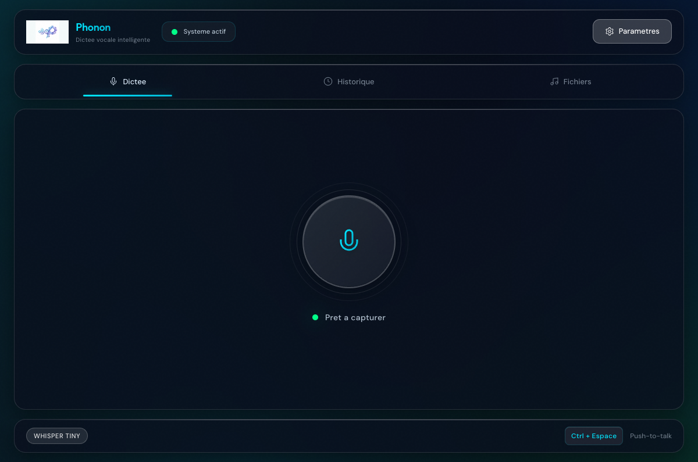
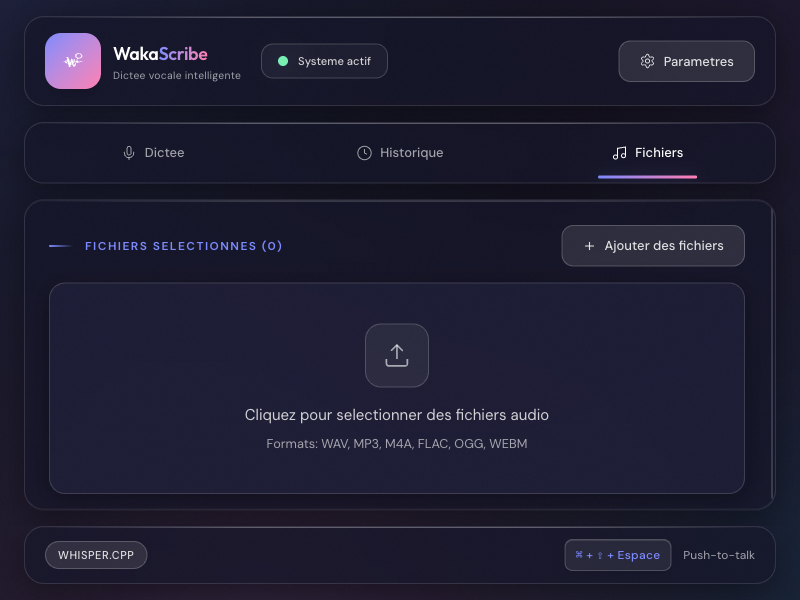
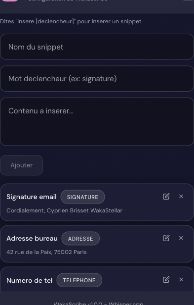
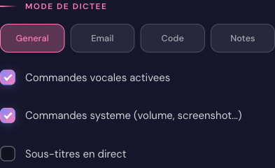
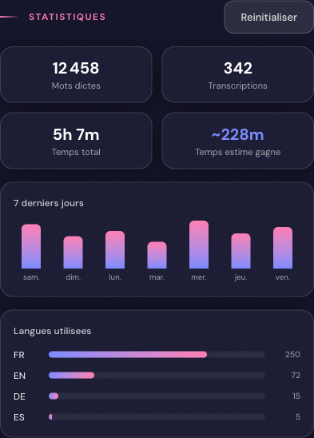
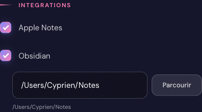
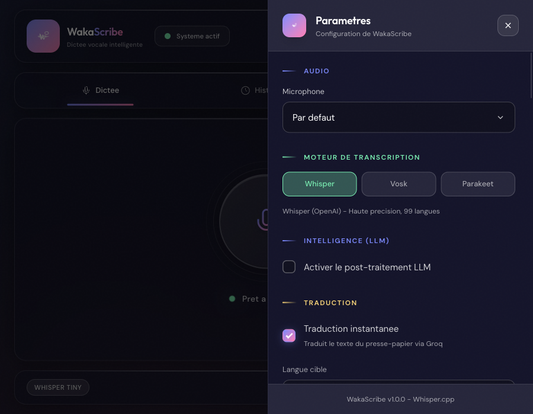
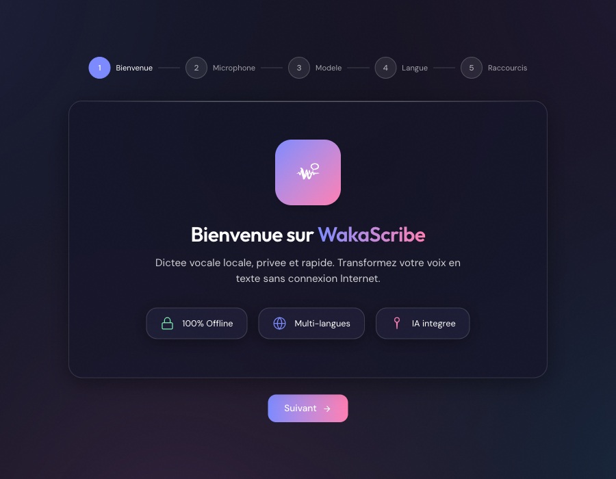

<p align="center">
  
</p>

<h1 align="center">Phonon</h1>

<p align="center">
  <strong>Dictée vocale intelligente, locale et privée</strong>
</p>

<p align="center">
  <a href="#fonctionnalités">Fonctionnalités</a> •
  <a href="#moteurs-de-transcription">Moteurs</a> •
  <a href="#installation">Installation</a> •
  <a href="#utilisation">Utilisation</a> •
  <a href="#paramètres">Paramètres</a> •
  <a href="#faq">FAQ</a>
</p>

<p align="center">
  
  
  
  
</p>

---

## Présentation

**Phonon** est une application de dictée vocale nouvelle génération qui transforme votre voix en texte avec une précision remarquable. Contrairement aux solutions cloud, Phonon fonctionne **100% en local** sur votre machine, garantissant une confidentialité totale de vos données.

### Points forts

| | |
|---|---|
| **100% Local** | Aucune donnée n'est envoyée sur Internet. Votre vie privée est préservée. |
| **Ultra rapide** | Transcription en temps réel grâce à des moteurs optimisés |
| **Multi-moteurs** | Whisper, Vosk ou Parakeet selon vos besoins |
| **Multilingue** | Support de 99 langues avec détection automatique |
| **IA Intégrée** | Amélioration du texte via LLM (optionnel, Groq) |
| **Commandes vocales** | Ponctuation, formatage, snippets et commandes système par la voix |
| **Statistiques** | Suivi de productivité avec graphiques et distribution des langues |
| **Intégrations** | Envoi vers Apple Notes et Obsidian en un clic |
| **Cross-platform** | macOS, Windows et Linux |
| **Gratuit** | Freeware, usage illimité |

---

## Fonctionnalités

### Dictée vocale

#### Mode Push-to-Talk (PTT)
Maintenez une touche pour parler, relâchez pour transcrire et coller automatiquement.

```
Maintenir ⌘+Shift+Espace → Parler → Relâcher → Texte collé automatiquement
```

#### Mode Toggle
Cliquez pour démarrer/arrêter l'enregistrement via l'interface.

#### Streaming temps réel
Voyez le texte apparaître en temps réel pendant que vous parlez.

---

### Transcription de fichiers audio

<p align="center">
  
</p>

Transcrivez vos fichiers audio existants :

| Format | Extension |
|--------|-----------|
| WAV | `.wav` |
| MP3 | `.mp3` |
| M4A/AAC | `.m4a` |
| FLAC | `.flac` |
| OGG Vorbis | `.ogg` |
| WebM | `.webm` |

- Glissez-déposez vos fichiers ou utilisez le sélecteur
- Transcription par lot (plusieurs fichiers à la fois)
- Rééchantillonnage automatique vers 16kHz

---

### Modes de dictée

Phonon adapte la transcription selon le contexte :

| Mode | Description | Optimisation |
|------|-------------|--------------|
| **Général** | Texte standard, emails, notes | Ponctuation naturelle |
| **Email** | Optimisé pour les courriels | Formules de politesse, structure |
| **Code** | Pour les développeurs | Préserve la syntaxe technique |
| **Notes** | Prise de notes rapide | Format concis, bullet points |

---

### Amélioration par IA (LLM)

Activez l'amélioration par intelligence artificielle pour :

- Corriger automatiquement la grammaire et l'orthographe
- Ajouter la ponctuation manquante
- Reformuler pour plus de clarté
- Adapter le style au mode de dictée

> **Note** : Le LLM utilise l'API Groq (gratuite) et nécessite une connexion Internet.

---

### Commandes vocales

Contrôlez la ponctuation et le formatage avec votre voix :

| Commande vocale | Résultat |
|-----------------|----------|
| "Nouveau paragraphe" | ↵ (saut de ligne) |
| "Point" | . |
| "Virgule" | , |
| "Point d'interrogation" | ? |
| "Point d'exclamation" | ! |
| "Deux points" | : |
| "Ouvrir les guillemets" | « |
| "Fermer les guillemets" | » |

---

### Snippets vocaux

<p align="center">
  
</p>

Créez des raccourcis vocaux pour insérer automatiquement du texte prédéfini :

- **Dites "insère [déclencheur]"** pour insérer un snippet
- Gérez vos snippets depuis les paramètres (nom, mot-déclencheur, contenu)
- Idéal pour les signatures, adresses, formules types, numéros de téléphone

```
Exemple : "insère signature" → "Cordialement, Cyprien Brisset"
```

---

### Commandes système & Formatage vocal

<p align="center">
  
</p>

Contrôlez votre système et le formatage du texte par la voix :

#### Commandes système

| Commande vocale | Action |
|-----------------|--------|
| "Commande screenshot" | Capture d'écran |
| "Commande verrouille" | Verrouiller l'écran |
| "Commande ne pas déranger" | Activer/désactiver Ne pas déranger |
| "Volume à 50" | Régler le volume à 50% |

#### Formatage

| Commande vocale | Action |
|-----------------|--------|
| "Mets en gras" | Applique le gras (⌘+B) |
| "En italique" | Applique l'italique (⌘+I) |
| "Commande souligne" | Applique le souligné (⌘+U) |

> **Note** : Les commandes système sont activables/désactivables dans les paramètres.

---

### Statistiques d'utilisation

<p align="center">
  
</p>

Suivez votre productivité vocale en temps réel :

- **Total de mots dictés** et nombre de transcriptions
- **Temps total** d'utilisation et estimation du temps gagné
- **Graphique des 7 derniers jours** avec nombre de mots par jour
- **Distribution des langues** utilisées
- Bouton de réinitialisation des statistiques

---

### Drag & Drop de fichiers audio

Glissez-déposez directement vos fichiers audio dans la fenêtre de WakaScribe :

- Un overlay visuel apparaît pour indiquer la zone de dépôt
- Les fichiers sont automatiquement ajoutés à l'onglet Fichiers
- Formats supportés : WAV, MP3, M4A, FLAC, OGG, WebM

---

### Sous-titres en direct

Affichez le texte de votre dictée en temps réel dans une fenêtre flottante :

- **Fenêtre transparente** toujours au premier plan
- Déplaçable par glisser-déposer
- Auto-disparition après 5 secondes d'inactivité
- Activable depuis les paramètres ou le menu de la barre système
- Taille de police configurable

---

### Intégrations Notes

<p align="center">
  
</p>

Envoyez vos transcriptions directement vers vos applications de notes :

#### Apple Notes (macOS uniquement)
- Crée automatiquement une nouvelle note avec le contenu transcrit
- Activable dans Paramètres → Intégrations

#### Obsidian
- Crée un fichier Markdown dans votre vault Obsidian
- Sélectionnez le chemin de votre vault dans les paramètres
- Fonctionne sur macOS, Windows et Linux

> Bouton **"Envoyer vers..."** disponible dans l'historique et la transcription de fichiers.

---

### Historique

<p align="center">
  
</p>

Accédez facilement à vos transcriptions passées :

- **50 dernières transcriptions** conservées
- Accès rapide depuis l'onglet Historique
- **Copie en un clic** dans le presse-papier
- Affichage de la durée et du temps de traitement
- Suppression individuelle ou totale

---

### Traduction instantanée

Traduisez le texte sélectionné dans n'importe quelle application :

1. Sélectionnez du texte
2. Appuyez sur `⌘+Shift+T` (ou votre raccourci personnalisé)
3. Le texte traduit remplace la sélection

**Langues cibles disponibles** : Français, Anglais, Allemand, Espagnol, Italien, Portugais, Néerlandais, Russe, Chinois, Japonais, Coréen, Arabe

---

## Moteurs de transcription

<p align="center">
  
</p>

Phonon propose trois moteurs de transcription :

### Whisper (OpenAI)

| Modèle | Taille | Qualité | Recommandé pour |
|--------|--------|---------|-----------------|
| **Tiny** | 75 Mo | ⭐⭐ | Tests rapides |
| **Small** | 466 Mo | ⭐⭐⭐ | Usage quotidien |
| **Medium** | 1.5 Go | ⭐⭐⭐⭐ | Qualité maximale |

- 99 langues supportées
- Haute précision
- Fonctionne sur tous les systèmes

### Vosk

- Modèles légers et rapides
- Idéal pour les machines moins puissantes
- Langues principales : Français, Anglais, Allemand, Espagnol, etc.

### Parakeet (Apple Silicon)

| Variante | Technologie | Plateforme |
|----------|-------------|------------|
| **Parakeet TDT 0.6B v3 CoreML** | CoreML | macOS (Apple Silicon) |
| **Parakeet TDT 0.6B v3 ONNX** | ONNX Runtime | Windows, Linux |

- Modèle NVIDIA NeMo optimisé
- Excellente qualité pour le français et l'anglais
- Accélération matérielle native sur Mac M1/M2/M3/M4
- Source : [FluidInference/parakeet-tdt-0.6b-v3-coreml](https://huggingface.co/FluidInference/parakeet-tdt-0.6b-v3-coreml)

---

## Installation

### macOS

1. **Téléchargez** le fichier `.dmg` correspondant à votre Mac :
   - **Mac Intel** : `Phonon_x64.dmg`
   - **Mac M1/M2/M3/M4** : `Phonon_arm64.dmg`

2. **Ouvrez** le fichier `.dmg`

3. **Glissez** Phonon dans le dossier Applications

4. **Premier lancement** : Clic droit → Ouvrir (contournement Gatekeeper)

5. **Autorisez les permissions** :
   ```
   Réglages Système → Confidentialité et sécurité → Microphone → ✅ Phonon
   Réglages Système → Confidentialité et sécurité → Accessibilité → ✅ Phonon
   ```

### Windows

1. **Téléchargez** `Phonon_Setup.exe`
2. **Exécutez** l'installateur
3. **Suivez** les instructions à l'écran
4. **Lancez** Phonon depuis le menu Démarrer

### Linux

1. **Téléchargez** le paquet correspondant :
   - `.deb` pour Ubuntu/Debian
   - `.rpm` pour Fedora/RHEL
   - `.AppImage` pour toutes distributions

2. **Installez** les dépendances pour l'auto-paste :

   **X11 (Ubuntu/Debian):**
   ```bash
   sudo apt install xclip xdotool
   ```

   **Wayland (Ubuntu/Debian):**
   ```bash
   sudo apt install wl-clipboard wtype
   ```

3. **Installez** l'application :
   ```bash
   # Debian/Ubuntu
   sudo dpkg -i phonon_*.deb

   # Ou AppImage
   chmod +x Phonon_*.AppImage
   ./Phonon_*.AppImage
   ```

---

## Utilisation

### Premier lancement — Assistant d'accueil

<p align="center">
  
</p>

Au premier lancement, un assistant vous guide en 5 étapes :

1. **Bienvenue** — Présentation de WakaScribe
2. **Microphone** — Demande de permission d'accès au micro
3. **Modèle** — Choix et téléchargement du moteur de transcription
4. **Langue** — Sélection de la langue de dictée
5. **Raccourcis** — Configuration des raccourcis clavier

L'assistant recommande automatiquement le meilleur moteur pour votre configuration :
- **Mac M1/M2/M3/M4** : Parakeet CoreML
- **Mac Intel / Windows / Linux** : Whisper Small
- **Machine peu puissante** : Vosk

---

### Workflow quotidien

```
1. Placez votre curseur là où vous voulez écrire (email, document, chat...)
2. Maintenez ⌘+Shift+Espace (ou votre raccourci personnalisé)
3. Parlez naturellement
4. Relâchez la touche
5. Le texte apparaît automatiquement !
```

### Conseils pour de meilleurs résultats

- **Parlez clairement** mais naturellement
- **Évitez le bruit de fond** excessif
- **Phrases complètes** : la ponctuation est mieux détectée
- **Une seule langue** par enregistrement pour de meilleurs résultats

---

## Paramètres

Accédez aux paramètres via le bouton ⚙️ ou `⌘+,`

### Audio

| Paramètre | Description |
|-----------|-------------|
| **Microphone** | Périphérique d'entrée audio |
| **Streaming** | Affichage temps réel pendant l'enregistrement |

### Moteur de transcription

| Paramètre | Description |
|-----------|-------------|
| **Whisper** | Moteur OpenAI, haute précision |
| **Vosk** | Moteur léger et rapide |
| **Parakeet** | Moteur NVIDIA NeMo, optimisé Apple Silicon |

### Langue

| Paramètre | Description |
|-----------|-------------|
| **Langue** | Langue parlée (99 langues + Auto) |
| **Détection auto** | Laisse le moteur détecter la langue |

### LLM (Intelligence Artificielle)

| Paramètre | Description |
|-----------|-------------|
| **Activer LLM** | Amélioration par IA |
| **Clé API Groq** | Authentification (gratuite) |

#### Obtenir une clé API Groq (gratuite)

1. Rendez-vous sur [console.groq.com](https://console.groq.com)
2. Créez un compte gratuit
3. Allez dans **API Keys**
4. Cliquez sur **Create API Key**
5. Copiez la clé et collez-la dans Phonon

### Dictée

| Paramètre | Description |
|-----------|-------------|
| **Commandes vocales** | Ponctuation et édition par la voix |
| **Commandes système** | Volume, screenshot, verrouillage par la voix |
| **Sous-titres en direct** | Fenêtre flottante avec texte temps réel |

### Snippets vocaux

| Paramètre | Description |
|-----------|-------------|
| **Nom** | Nom descriptif du snippet |
| **Déclencheur** | Mot-clé pour l'insertion vocale |
| **Contenu** | Texte à insérer automatiquement |

### Statistiques

| Paramètre | Description |
|-----------|-------------|
| **Suivi activé** | Active/désactive le suivi de productivité |
| **Réinitialiser** | Remet les compteurs à zéro |

### Intégrations

| Paramètre | Description |
|-----------|-------------|
| **Apple Notes** | Envoyer les transcriptions vers Notes (macOS) |
| **Obsidian** | Envoyer vers un vault Obsidian + chemin du vault |

### Raccourcis

| Paramètre | Défaut |
|-----------|--------|
| **Push-to-Talk** | `⌘+Shift+Espace` |
| **Toggle Record** | `⌘+Shift+R` |
| **Traduction** | `⌘+Shift+T` |

---

## Raccourcis clavier

### Raccourcis globaux

Ces raccourcis fonctionnent même quand Phonon n'est pas au premier plan :

| Raccourci macOS | Raccourci Windows/Linux | Action |
|-----------------|------------------------|--------|
| `⌘+Shift+Espace` | `Ctrl+Shift+Espace` | Push-to-Talk (maintenir) |
| `⌘+Shift+R` | `Ctrl+Shift+R` | Toggle enregistrement |
| `⌘+Shift+T` | `Ctrl+Shift+T` | Traduire la sélection |
| `⌥+⌘+V` | `Alt+Ctrl+V` | Coller dernière transcription |

### Dans l'application

| Raccourci macOS | Raccourci Windows/Linux | Action |
|-----------------|------------------------|--------|
| `⌘+,` | `Ctrl+,` | Ouvrir les paramètres |
| `⌘+1` | `Ctrl+1` | Onglet Dictée |
| `⌘+2` | `Ctrl+2` | Onglet Historique |
| `⌘+3` | `Ctrl+3` | Onglet Fichiers |
| `⌘+Q` | `Alt+F4` | Quitter |

---

## Dépannage

<details>
<summary><strong>Le microphone n'est pas détecté</strong></summary>

1. Vérifiez que le microphone est correctement branché
2. **macOS** : Réglages Système → Confidentialité → Microphone → ✅ Phonon
3. **Windows** : Paramètres → Confidentialité → Microphone → Autoriser les applications
4. Redémarrez Phonon
</details>

<details>
<summary><strong>L'auto-paste ne fonctionne pas</strong></summary>

**macOS :**
```
Réglages Système → Confidentialité et sécurité → Accessibilité
→ Activez Phonon
```

**Windows :**
- Exécutez Phonon en tant qu'administrateur (pour certaines applications)

**Linux :**
```bash
# X11
sudo apt install xdotool xclip

# Wayland
sudo apt install wtype wl-clipboard
```
</details>

<details>
<summary><strong>La transcription est lente</strong></summary>

1. Utilisez un modèle plus léger (Tiny ou Vosk)
2. Sur Mac Apple Silicon, utilisez Parakeet CoreML
3. Fermez les applications gourmandes en ressources
4. Redémarrez l'application
</details>

<details>
<summary><strong>Le LLM ne fonctionne pas</strong></summary>

1. Vérifiez votre connexion Internet
2. Dans Paramètres → LLM :
   - Vérifiez que "Activer LLM" est coché
   - Cliquez sur "Valider" pour tester votre clé API
3. Si la clé est invalide, générez-en une nouvelle sur [console.groq.com](https://console.groq.com)
</details>

---

## FAQ

<details>
<summary><strong>Phonon est-il vraiment gratuit ?</strong></summary>

Oui ! Phonon est un freeware 100% gratuit. Pas d'abonnement, pas de limite d'utilisation, pas de publicité.
</details>

<details>
<summary><strong>Mes données vocales sont-elles envoyées sur Internet ?</strong></summary>

**Non.** La transcription est effectuée **100% en local** sur votre machine. Vos enregistrements audio ne quittent jamais votre ordinateur.

**Exception** : Si vous activez le LLM, le **texte transcrit** (pas l'audio) est envoyé à l'API Groq pour amélioration. Cette fonctionnalité est optionnelle.
</details>

<details>
<summary><strong>Quel moteur choisir ?</strong></summary>

| Votre configuration | Moteur recommandé |
|---------------------|-------------------|
| Mac M1/M2/M3/M4 | Parakeet CoreML |
| Mac Intel | Whisper Small |
| PC moderne | Whisper Small |
| PC ancien | Vosk |
</details>

<details>
<summary><strong>Puis-je utiliser Phonon hors ligne ?</strong></summary>

**Oui !** Toutes les fonctionnalités principales (transcription, commandes vocales, historique, transcription de fichiers) fonctionnent **sans connexion Internet**.

Seuls le LLM et la traduction nécessitent une connexion.
</details>

<details>
<summary><strong>Quelles langues sont supportées ?</strong></summary>

Avec Whisper, Phonon supporte **99 langues**, dont :
Français, Anglais, Allemand, Espagnol, Italien, Portugais, Néerlandais, Polonais, Russe, Chinois, Japonais, Coréen, Arabe, Hindi, et bien d'autres.
</details>

---

## Performances

### Vitesse de transcription

| Configuration | Whisper Small | Parakeet CoreML |
|--------------|---------------|-----------------|
| Mac M1/M2/M3/M4 | ~12x temps réel | ~15x temps réel |
| Mac Intel i7+ | ~6x temps réel | N/A |
| Windows (CPU moderne) | ~5x temps réel | ~8x temps réel (ONNX) |

> **Exemple** : Un audio de 10 secondes est transcrit en moins d'1 seconde sur Mac M2.

### Latence bout-en-bout

| Étape | Durée typique |
|-------|---------------|
| Capture audio | Temps réel |
| Transcription | < 1 sec |
| LLM (si activé) | 0.5-2 sec |
| Auto-paste | < 100 ms |
| **Total** | **< 3 sec** |

---

## Confidentialité & Sécurité

Phonon a été conçu avec la vie privée comme priorité absolue :

| Aspect | Garantie |
|--------|----------|
| **Audio** | Traité 100% localement, jamais envoyé |
| **Télémétrie** | Aucune collecte de données |
| **Historique** | Stocké uniquement sur votre machine |
| **Clés API** | Stockées dans le trousseau sécurisé du système |
| **LLM** | Optionnel - seul le texte est envoyé (pas l'audio) |

---

## Stack technique

```
Frontend: React 18 + TypeScript + TailwindCSS + Zustand
Backend:  Rust/Tauri 2.x + cpal + reqwest + keyring
Moteurs:  Whisper.cpp (whisper-rs), Vosk, Parakeet (CoreML/ONNX)
UI:       Design Frosted Touch (glassmorphism)
```

---

## Support & Communauté

| Canal | Lien |
|-------|------|
| Email | support@phonon.com |
| Signaler un bug | [GitHub Issues](https://github.com/cyprienbrisset/scribe/issues) |

---

## Licence

Phonon est un **freeware** distribué gratuitement.

- Usage personnel et professionnel autorisé
- Distribution gratuite autorisée
- Revente interdite
- Modification du code source interdite

---

<p align="center">
  Fait avec ❤️ par <strong>Cyprien Brisset</strong>
</p>

<p align="center">
  <sub>© 2024-2026 Tous droits réservés.</sub>
</p>
